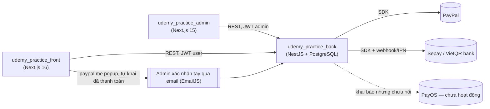
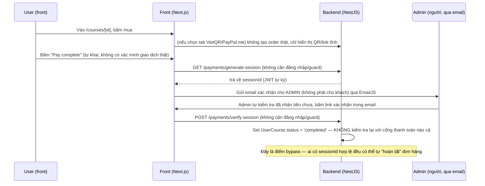

# Kiến trúc tổng thể (trọng tâm luồng bán course)

## 1. Ba repo & cách kết nối

- Backend là **nguồn sự thật duy nhất**: entity `Course`, `UserCourse` (bản ghi enrollment/"order"), thanh toán.
- Admin và Front đều gọi thẳng backend qua REST, không qua BFF/gateway riêng.
- Admin dùng Firebase **chỉ cho lưu trữ file** (và hiện đang không hoạt động đúng — xem `udemy_practice_admin/docs/admin.md`), auth admin vẫn đi qua backend JWT, Firebase không liên quan tới auth.
- Không có `middleware.ts` cấp Next.js ở front; bảo vệ route được làm ở tầng layout server component.

## 2. Cổng chạy dev (suy ra từ config, chưa xác nhận 100% — xem mục 3 trong `open-questions.md`)

- Backend: theo `NEXT_PUBLIC_API_URL` trong admin `.env` → `http://localhost:3333`.
- Admin: theo CORS allow-list trong `back/src/main.ts` (`localhost:3000`) và biến `NEXT_PUBLIC_CLIENT_URL=:3001` trong admin → suy luận admin chạy ở `3000`, front (khách hàng) chạy ở `3001`.

## 3. Ba luồng "bán" đang tồn tại song song trên `udemy_practice_front`

Đây là phát hiện quan trọng nhất về kiến trúc: **không chỉ có một luồng bán course**, mà có 3 sản phẩm khác nhau, mỗi cái có checkout riêng, trùng lặp logic thanh toán:

| # | Sản phẩm | Trang bắt đầu | Backend gọi tới | Cách xác nhận thanh toán |
|---|---|---|---|---|
| 1 | **Course của chính platform** (trọng tâm chính) | `/courses/[id]` → `Payment` component | `udemy_practice_back` (`/payments/*`, `/user-courses`) | VietQR tự khai "Pay complete" *hoặc* PayPal.me tự khai, admin xác nhận tay qua email; **có sẵn 1 luồng PayPal Orders chuẩn nhưng không được gắn vào UI nào** |
| 2 | **"Buy Udemy Course"** — dịch vụ mua hộ course Udemy của bên thứ 3 | `/buy-course` | Một **backend hoàn toàn khác** qua `NEXT_PUBLIC_BUY_COURSE` | VietQR/PayPal.me tự khai, gọi `confirm-payment` — chưa rõ backend đó có verify thật không |
| 3 | **"Download Tool"** — bán license phần mềm desktop | `/buy-course/download-tool` → cart → checkout | Cùng backend ở mục 2, endpoint `/download-tool/licenses` | **Không có bước thanh toán nào trong checkout** — chỉ tạo "license request", thanh toán/giao hàng có vẻ làm ngoài hệ thống |

→ Khi bạn nói "tập trung vào bán course", tài liệu này ưu tiên **luồng #1**. Luồng #2 và #3 được ghi chú lại vì chúng dùng chung nhiều component UI (VietQR, PayPal.me) nhưng là sản phẩm khác, để tránh nhầm lẫn khi đọc code.

## 4. Vòng đời một lượt mua course (luồng #1, mô tả theo code thực tế — không phải theo thiết kế lý tưởng)

Song song đó, backend có sẵn:
- Luồng **Sepay IPN** (`POST /payments/sepay/ipn`) — có vẻ là luồng "đúng" nhất về mặt idempotency (check trùng theo `order_invoice_number`), nhưng **frontend không gọi luồng checkout Sepay này** (`paymentService.sepayCheckout` không có nơi nào gọi tới).
- Luồng **PayPal Orders chuẩn** (`POST /payments/orders` + `/capture`) — có sẵn ở backend và có component frontend implement đúng (`checkout-paypal.tsx`), nhưng **không được import vào page nào** → dead code.

Chi tiết từng cổng thanh toán: xem `payments.md`. Chi tiết vì sao đây là vấn đề an ninh: xem `open-questions.md`.
